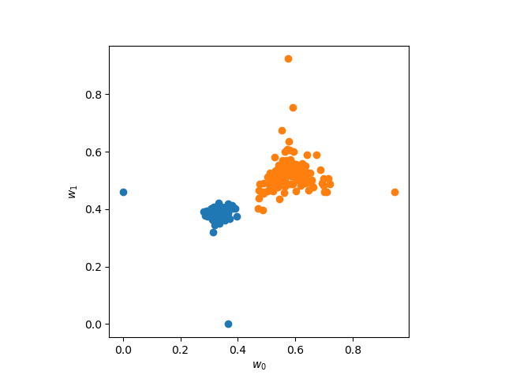
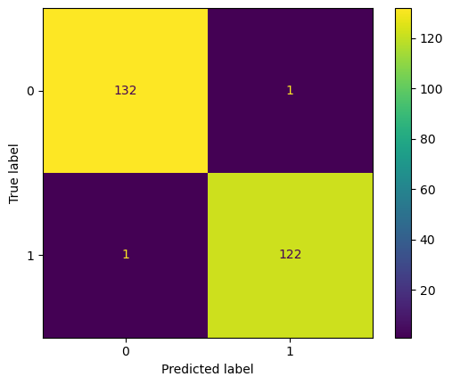
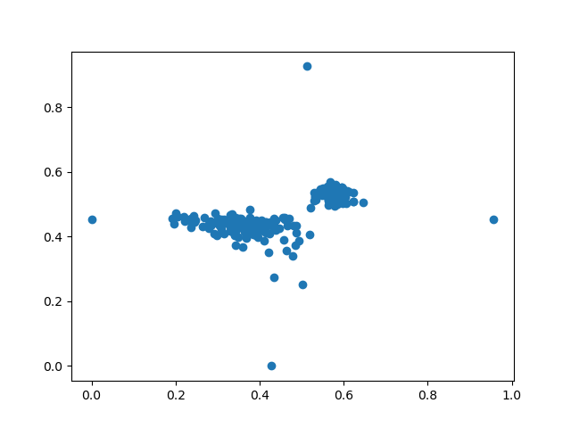

# FastMapSVM: An Algorithm for Classifying Complex Objects
This is the official repository for the FastMapSVM algorithm associated with **"FastMapSVM: Classifying Complex Objects Using the FastMap algorithm and Support-Vector Machines"** (White et al., in review). The pre-print is available on arXiv: https://arxiv.org/abs/2204.05112. If you make use of this code, please cite White et al. (2022) where appropriate (full reference at bottom of page).


# Installation
```bash
>$ pip install .
```

# Tutorial
This tutorial is available as a IPython notebook in `tutorials/tutorial.ipynb`.
```python
import fastmap
import h5py
import matplotlib.pyplot as plt
import numpy as np
import sklearn.metrics
import sklearn.pipeline
import sklearn.preprocessing
import sklearn.svm
```
## 1. Introduction: $X \rightarrow$ FastMap $\rightarrow$ SVM $\rightarrow \widehat{y}$
This tutorial demonstrates how to train and deploy the FastMapSVM classification model. As the name implies, FastMapSVM comprises two critical components: (1) the FastMap algorithm, and (2) an SVM classifier. The FastMap algorithm is implemented as a data transformation compatible with the `sklearn.pipeline.Pipeline` API. This allows the FastMapSVM model to be implemented as a simple `Pipeline` with optional intermediate transformations, such as data re-scaling.

## 2. Setup
### 2.1 Define the distance function
To deploy the FastMapSVM algorithm, the user must define the distance function that quantifies the dissimilarity between any pair of objects in the train/test data. The distance function must adhere to NumPy's [broadcasting rules](https://numpy.org/doc/stable/user/basics.broadcasting.html): Given input arrays `a` and `b` with shapes $(M, 1, ...)$ and $(1, N, ...)$, respectively, it should return the $M \times N$ distance matrix.
```python
def correlation_distance(a, b, axis=-1):
        '''
        Compute the pair-wise correlation distance matrix.
        '''
        xcorr = correlate(a, b, axis=axis)
        xcorr = np.abs(xcorr)
        xcorr = np.nanmean(xcorr, axis=-2)
        xcorr = np.max(xcorr, axis=-1)
        xcorr = np.clip(xcorr, 0, 1)
        
        return 1 - xcorr
    

def correlate(a, b, axis=-1):
    A = np.fft.rfft(a, axis=axis)
    B = np.fft.rfft(b, axis=axis)
    X = A * np.conj(B)
    x = np.fft.irfft(X)
    x = np.fft.fftshift(x, axes=axis)
    norm = np.sqrt(
        a.shape[-1] * np.var(a, axis=axis)
        *
        b.shape[-1] * np.var(b, axis=axis)
    )
    norm = norm[..., np.newaxis]

    return np.nan_to_num(x / norm, neginf=0, posinf=0)
```

**Note**: If your distance cannot be easily vectorized, the code below implements a generic loop that applies the necessary broadcasting rules and calls the distance function in singleton fashion (i.e., on individual pairs of objects).

```python
def generic_distance(a, b, axis=-1):
    # Build the output array with broadcasting rules applied.
    shape = np.broadcast_shapes(a.shape, b.shape)
    axis = axis if axis > 1 else len(shape) + axis
    shape = shape[:axis] + shape[axis+1:]
    output = np.empty(shape)
    n_dim = output.ndim

    # Loop over elements and compute distances serially.
    for ijk in np.ndindex(*output.shape):
        ijk_a = tuple([ijk[i] if a.shape[i] != 1 else 0 for i in range(len(ijk))])
        ijk_b = tuple([ijk[i] if b.shape[i] != 1 else 0 for i in range(len(ijk))])
        output[ijk] = dist(a[ijk_a], b[ijk_b])
        
    return output
        
def dist(a, b, axis=-1):
    '''
    Return the distance between objects a and b.
    '''
    return np.linalg.norm(a - b, axis=axis)
```
    
### 2.2 Implement concrete FastMap class.
The `fastmap` module provides an abstract base class `fastmap.FastMapABC` that is not intended to be used directly. The user should define a child class that adds a `_distance_function` attribute to the abstract base class. Implementing the model this way supports models persistence.
```python
class FastMap(fastmap.FastMapABC):
    def __init__(self, *args, **kwargs):
        super().__init__(*args, **kwargs)
        self._distance_func = correlation_distance
```
## 3. Model training
### 3.1 Load the train and test data.
```python
with h5py.File('data/ridgecrest.hdf5', mode='r') as in_file:
    X_train = in_file['/X/train'][:]
    y_train = in_file['/y/train'][:]

    X_test = in_file['/X/test'][:]
    y_test = in_file['/y/test'][:]
```

### 3.2 Build a `sklearn.pipeline.Pipeline`
The FastMapSVM model benefits from rescaling the extracted features before SVM classification.
```python
n_dim = 2 # The number of dimensions for the Euclidean embedding.
fastmapsvm = sklearn.pipeline.Pipeline([
    ('fastmap', FastMap(n_dim)),
    ('scaler', sklearn.preprocessing.StandardScaler()),
    ('svc', sklearn.svm.SVC())
])
```

### 3.3 Train and score the model using the train data
```python
fastmapsvm.fit(X_train, y_train);
fastmapsvm.score(X_train, y_train)
```

### 3.4 View the embedding of the train data
Sub-components of the Pipeline can be extracted via indexing.
```python
# Compute the embedding of the train data
W = fastmapsvm[0].transform(X_train)

plt.close('all')
fig, ax = plt.subplots()
for label in range(2):
    idxs = np.argwhere(y_train == label).flatten()
    ax.scatter(W[idxs, 0], W[idxs, 1])
ax.set_aspect(1)
ax.set_xlabel('$w_0$')
ax.set_ylabel('$w_1$')
```


## 4. Model testing
### 4.1 Score the model on the test data.
```python
# For bigger data sets, it is helpful to have a progress bar
fastmapsvm['fastmap'].show_progress = True

fastmapsvm.score(X_test, y_test)
```

### 4.2 Plot the confusion matrix for the test data
```python
y_hat = fastmapsvm.predict(X_test)
sklearn.metrics.ConfusionMatrixDisplay.from_predictions(
    y_test, 
    y_hat
)
```


## 5. Model persistence
### 5.1 Store the trained model on disk
```python
import joblib
joblib.dump(fastmapsvm, 'fastmapsvm.joblib')

del(fastmapsvm)
```
### 5.2 Load a pre-trained model from disk
**Note:** The distance function must be defined within the scope in which you load the model. So, if you train the model in one script, and then try to reload it in another script in which the distance function is not defined, it will not work. For instance, if you restart your Python kernel and immediately run the cell below, before running anything else, you will get `AttributeError: Can't get attribute 'FastMap' on <module '__main__'>`. There is, to my knowledge, no clean way of storing user-defined code and its dependencies alongside the model. The abstract base class paradigm is used to force users to write code in a way that will make it easier for them to reload the model later.

If you restart your Python kernel, you need to run the code in sections 2.1 and 2.2 (along with the necessary imports) before running the code in this section.
```python
import joblib
fastmapsvm = joblib.load('fastmapsvm.joblib')
```
## 6. Unsupervised clustering
FastMap was originally designed for unsupervised cluster analysis, and can be trained in unsupervised mode by omitting the labels on training.
```python
fm = FastMap(2)
fm.fit(X_train)
W = fm.transform(X_train)

plt.close('all')
fig, ax = plt.subplots()
ax.scatter(W[:, 0], W[:, 1])
```


# References

Faloutsos, C., & Lin, K.-I. (1995). FastMap: A Fast Algorithm for Indexing, Data-Mining and Visualization of Traditional and Multimedia Datasets. _ACM SIGMOD Record, 24_(2), 163–174. https://doi.org/10.1145/568271.223812

White, M. C. A., Sharma, K., Li, A., Kumar, T. K. S., & Nakata, N. (2022). FastMapSVM: Classifying Complex Objects Using the FastMap Algorithm and Support-Vector Machines. _ArXiv_. http://arxiv.org/abs/2204.05112
